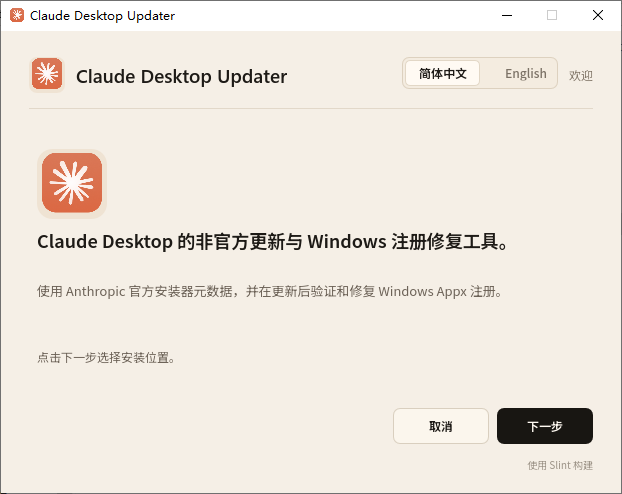
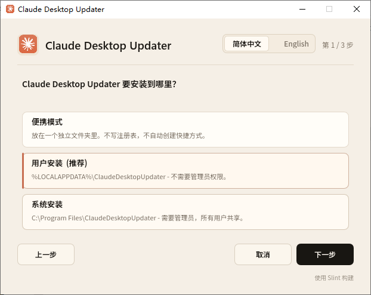
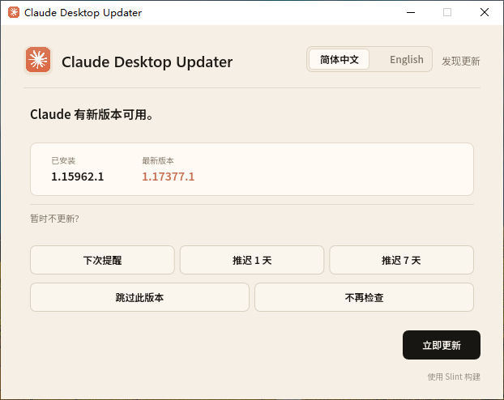
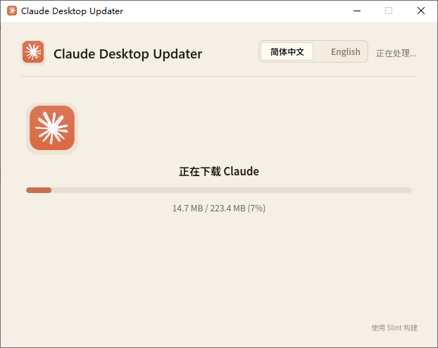
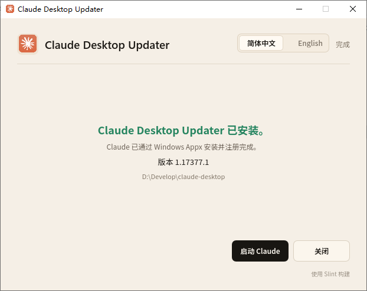
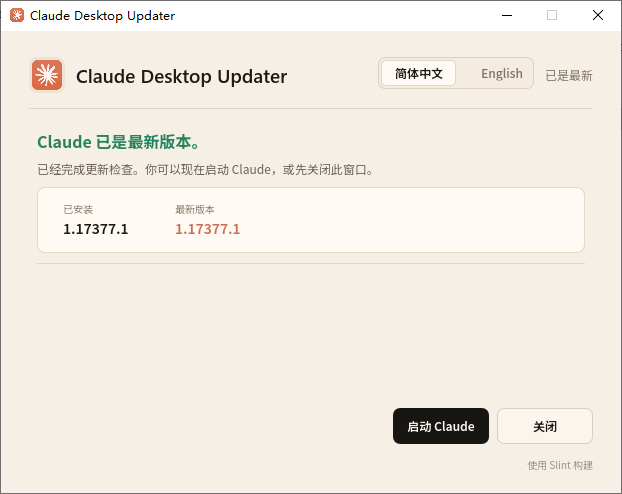

# Claude Desktop Updater

Claude Desktop Windows 非官方更新器与 Appx 注册修复工具。

本工具默认下载 Anthropic 官方 Claude Desktop MSIX 安装包，通过 Windows Appx/MSIX 机制安装，并在安装后验证 Claude 的 StartApps、`claude:` URL 协议、启动任务、打包服务和防火墙声明是否仍然完整。如果注册缺失或过期，会重新注册现有 `AppxManifest.xml`。

界面默认使用简体中文，也可以在窗口右上角切换到 English。语言选择会写入 `updater.json`，后续安装、更新和卸载界面会继续沿用。

本项目基于 `vaportail/codex-windows-updater` 改造，更新器代码使用 MIT License。本项目与 Anthropic 无关联，未获得 Anthropic 赞助、背书或认可。Claude、Claude Desktop、Anthropic 及相关品牌与素材归 Anthropic 所有。

## 功能

- 下载并安装 Anthropic 官方 Claude Desktop MSIX 包。
- 提供 GUI 优先的安装与更新流程，默认简体中文，可切换 English。
- 修复 Appx 注册，包括 StartApps、`claude:` URL 协议、启动任务、打包服务和防火墙声明。
- 更新前安全关闭官方 Claude Appx 进程，不依赖 PowerShell 进程脚本。
- 保留稳定的 `ClaudeDesktopUpdater/versions/current` junction 布局，方便工具和快捷方式引用当前 Claude 安装目录。

## 效果图














## 构建

需要 Windows、Rust 1.80+ 和 MSVC 工具链。

```powershell
.\scripts\package-release.ps1
```

打包产物：

```text
target/release/Claude Desktop Updater.exe
target/release/ClaudeDesktopUpdater/Claude Desktop Updater.exe
```

安装后的更新器根目录和开始菜单快捷方式都会使用 `Claude Desktop Updater.exe` 作为稳定入口。

## 安装目录

安装后的目录结构与 Codex updater 类似：

```text
ClaudeDesktopUpdater/
├── Claude Desktop Updater.exe
├── updater.json
├── downloads/
└── versions/
    ├── <package-version>/  -> current Claude Appx InstallLocation
    └── current/            -> <package-version>
```

Claude 仍然由 Windows Appx 包运行。`versions/` 下的条目是本地 NTFS junction，用来提供稳定的 Codex 风格目录布局，不替代 Windows 的包注册。对 Claude 来说，可执行文件路径是 `versions/current/app/Claude.exe`，因为 junction 指向 Appx 包根目录。

默认安装位置：

```text
便携模式：<当前目录>\ClaudeDesktopUpdater
用户模式：%LOCALAPPDATA%\ClaudeDesktopUpdater
系统模式：C:\Program Files\ClaudeDesktopUpdater
```

## 命令行诊断

`Claude Desktop Updater.exe` 是 Windows GUI 程序。普通用户推荐双击运行，或从开始菜单启动。

下面的参数主要用于开发和诊断。Release 构建使用 GUI 子系统，Windows 不一定会把 stdout/stderr 可靠附加到调用它的终端；日常使用请优先看 GUI 和错误详情。

```powershell
& '.\Claude Desktop Updater.exe' --status
& '.\Claude Desktop Updater.exe' --check
& '.\Claude Desktop Updater.exe' --update
& '.\Claude Desktop Updater.exe' --repair-register
& '.\Claude Desktop Updater.exe' --launch
```

### 诊断参数

| 参数 | 作用 |
|---|---|
| `--status` | 显示当前 Claude Appx 包、版本、安装目录、StartApps 注册、`claude:` 协议注册和包集成声明。 |
| `--check` | 解析 Anthropic 官方 MSIX 跳转地址并显示最新包信息。 |
| `--update` | 下载官方 MSIX，使用 `Add-AppxPackage` 安装，然后验证 Appx 注册。 |
| `--repair-register` | 使用当前 Claude `AppxManifest.xml` 执行 `Add-AppxPackage -Register`。 |
| `--launch` | 通过 `shell:appsFolder\Claude_pzs8sxrjxfjjc!Claude` 启动 Claude。 |
| `--uninstall` | 卸载本更新器，不卸载 Anthropic Claude。 |

## 注册检查

更新器会按以下 Claude 包身份进行检查：

```text
Package name:   Claude
Package family: Claude_pzs8sxrjxfjjc
AppID:          Claude_pzs8sxrjxfjjc!Claude
URL protocol:   claude:
Startup task:   ClaudeStartup
Service:        CoworkVMService
Executable:     app\Claude.exe
Firewall apps:  app\Claude.exe, app\resources\cowork-svc.exe
```

安装或更新后会验证：

```powershell
Get-AppxPackage -Name Claude
Get-StartApps | Where-Object { $_.AppID -eq 'Claude_pzs8sxrjxfjjc!Claude' }
Get-Item -LiteralPath 'Registry::HKEY_CLASSES_ROOT\claude'
```

同时会读取已安装的 `AppxManifest.xml`，确认 Claude 仍声明 `ClaudeStartup`、`CoworkVMService`，以及 `app\Claude.exe` 和 `app\resources\cowork-svc.exe` 的防火墙规则。

如果 AppID、URL 协议或包集成声明缺失，会执行：

```powershell
Add-AppxPackage -Path "<InstallLocation>\AppxManifest.xml" -Register -DisableDevelopmentMode -ForceApplicationShutdown
```

Claude 的启动任务、打包服务和防火墙规则都由 `AppxManifest.xml` 声明；重新注册 manifest 是修复这些 Windows 集成的路径。

## 已安装启动器行为

安装后，`Claude Desktop Updater.exe` 通常会通过以下入口启动 Claude：

```text
shell:appsFolder\Claude_pzs8sxrjxfjjc!Claude
```

它也会根据当前 `Get-AppxPackage -Name Claude` 结果同步 `updater.json`。当更新策略到期时，它会检查 Anthropic 官方 MSIX 源；如果有更新版本，会打开更新提示。推迟更新会记录到 `updater.json`；执行更新后会再次运行注册检查。

## 说明

- 更新器不会修改 Claude 自身的企业策略 `disableAutoUpdates`。
- 更新器只支持 Anthropic 官方 MSIX/Appx 安装路径。旧版本地 MSIX 安装和诊断提取参数已经不再支持，请使用 `--update`。
- 开始菜单快捷方式和“添加或删除程序”条目只属于本更新器，不会覆盖 Anthropic 官方 Claude 条目。

## English

Claude Desktop Updater is an unofficial Windows updater and Appx registration repair tool for Claude Desktop. The app is GUI-first, uses Simplified Chinese by default, and can be switched to English from the top-right language control.

It downloads Anthropic's official Claude Desktop MSIX package, installs it through Windows Appx/MSIX, and verifies StartApps, the `claude:` URL protocol, startup task, packaged service, and firewall declarations after installation.

## 致谢

🙏 感谢 [LINUX DO](https://linux.do/) 社区的支持与讨论。
